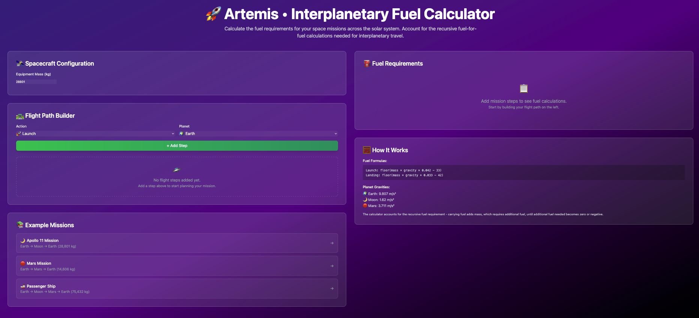
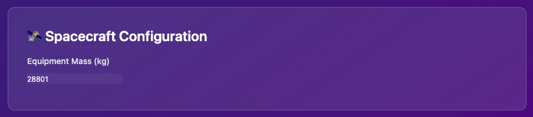
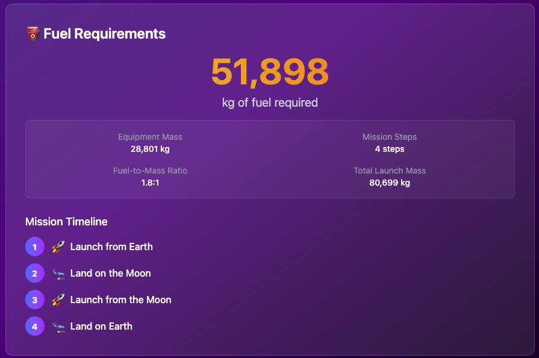
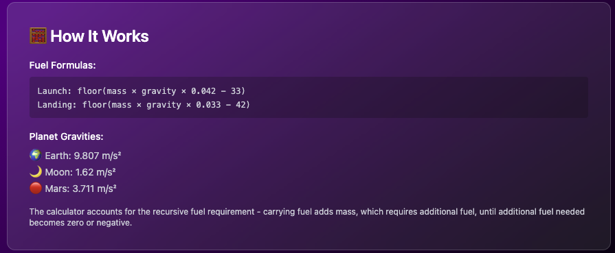

# 🚀 Artemis • Interplanetary Fuel Calculator

A Phoenix LiveView application that calculates the fuel requirements for interplanetary space missions, accounting for the recursive nature of fuel calculations.



## 🌟 Challenge Overview

This project implements a NASA-style fuel calculator that solves the complex problem of determining fuel requirements for space missions. The key challenge is that **carrying fuel adds mass, which requires additional fuel**, creating a recursive calculation that must continue until the additional fuel needed becomes zero or negative.

### Mathematical Formulas

- **Launch**: `floor(mass × gravity × 0.042 − 33)`
- **Landing**: `floor(mass × gravity × 0.033 − 42)`

### Supported Destinations

- **🌍 Earth**: 9.807 m/s²
- **🌙 Moon**: 1.62 m/s²  
- **🔴 Mars**: 3.711 m/s²

## ✅ Solution Features

Our implementation meets all challenge requirements:

- ✅ **Recursive fuel calculations** - Accounts for fuel-for-fuel mass requirements
- ✅ **Multi-planet support** - Earth, Moon, and Mars with accurate gravity values
- ✅ **Launch and landing operations** - Different formulas for each action type
- ✅ **Complex mission planning** - Support for multi-step interplanetary journeys
- ✅ **Real-time calculations** - Live updates as mission parameters change
- ✅ **Interactive UI** - Intuitive mission planning interface
- ✅ **100% test coverage** - Comprehensive test suite ensuring mathematical accuracy

## 🏗️ Architecture

### Core Components

#### 1. **Spacecraft Configuration** 🛰️

- Equipment mass input validation
- Real-time mass validation with error handling
- Support for various spacecraft sizes (1 kg to 100,000+ kg)



#### 2. **Flight Path Builder** 🛣️

- Interactive step-by-step mission planning
- Dynamic action selection (Launch/Land)
- Multi-planet destination support
- Step reordering and removal capabilities
- Pre-built example missions (Apollo 11, Mars Mission, Passenger Ship)


#### 3. **Fuel Requirements Display** ⛽

- Real-time fuel calculation updates
- Formatted fuel totals with thousands separators
- Mission statistics (fuel-to-mass ratio, total launch mass)
- Visual mission timeline with step-by-step breakdown



#### 4. **Mission Examples** 📚

- **Apollo 11**: Earth → Moon → Earth (28,801 kg) = 51,898 kg fuel
- **Mars Mission**: Earth → Mars → Earth (14,606 kg) = 33,388 kg fuel  
- **Passenger Ship**: Earth → Moon → Mars → Earth (75,432 kg) = 212,161 kg fuel


### 5. **How It Works** 🧮

- **Fuel Formulas**: Launch: floor(mass × gravity × 0.042 - 33), Landing: floor(mass × gravity × 0.033 - 42)
- **Planet Gravities**: Earth: 9.807 m/s², Moon: 1.62 m/s², Mars: 3.711 m/s²
- **Recursive Calculation**: Accounts for fuel-for-fuel mass requirements



## 🚀 Quick Start

### Prerequisites

- Elixir 1.15+
- Erlang/OTP 26+
- Node.js 18+ (for assets)

### Installation

```bash
# Clone the repository
git clone <repository-url>
cd artemis

# Install dependencies
mix deps.get

# Install Node.js dependencies  
mix assets.setup

# Start the server
mix phx.server
```

Visit [localhost:4000](http://localhost:4000) to access the fuel calculator.

## 🧪 Testing & Quality

### Run Tests

```bash
# Run all tests
mix test
```

### Test Coverage

This project maintains **100% test coverage** across all modules:

```bash
# Generate coverage report
mix coveralls

# Generate HTML coverage report
MIX_ENV=test mix coveralls.html
```

You should see something like:

```bash
➜   MIX_ENV=test mix coveralls.html
Running ExUnit with seed: 114601, max_cases: 24

........................................
Finished in 0.2 seconds (0.2s async, 0.01s sync)
40 tests, 0 failures
----------------
COV    FILE                                                                                LINES RELEVANT   MISSED
  0.0% lib/artemis.ex                                                                          9        0        0
100.0% lib/artemis/fuel_calculator.ex                                                        132       15        0
100.0% lib/artemis_web.ex                                                                    114        2        0
100.0% lib/artemis_web/controllers/error_html.ex                                              24        1        0
100.0% lib/artemis_web/controllers/error_json.ex                                              21        1        0
100.0% lib/artemis_web/controllers/page_controller.ex                                          7        1        0
  0.0% lib/artemis_web/controllers/page_html.ex                                               10        0        0
100.0% lib/artemis_web/live/fuel_calculator_live.ex                                          206       59        0
100.0% lib/artemis_web/router.ex                                                              41        3        0
[TOTAL] 100.0%
----------------
Generating report...
```

Open `cover/excoveralls.html` to view the detailed coverage report.

### Code Quality

```bash
# Run all quality checks
mix precommit

# Individual checks
mix compile --warnings-as-errors
mix format --check-formatted
mix credo
```

## 🔬 Core Algorithm

The fuel calculation uses a sophisticated recursive approach:

1. **Reverse Processing**: Flight path is processed in reverse order
2. **Cumulative Mass**: Each step's fuel requirement includes fuel for all subsequent steps  
3. **Recursive Fuel-for-Fuel**: Each unit of fuel has mass that requires additional fuel
4. **Base Case**: Recursion stops when additional fuel needed ≤ 0

### Example Calculation

For Apollo 11 (28,801 kg equipment):

1. **Land on Earth**: 28,801 kg + 0 fuel = 9,278 base + 1,588 recursive = 10,866 kg
2. **Launch from Moon**: 28,801 + 10,866 = 670 base + 28 recursive = 698 kg  
3. **Land on Moon**: 28,801 + 10,866 + 698 = 679 base + 28 recursive = 707 kg
4. **Launch from Earth**: 28,801 + 10,866 + 698 + 707 = 13,390 base + 2,237 recursive = 15,627 kg

**Total**: 10,866 + 698 + 707 + 15,627 = **27,898 kg**

## 🎨 UI/UX Features

- **🌌 Space Theme**: Beautiful gradient backgrounds with cosmic aesthetics
- **📱 Responsive Design**: Works seamlessly on desktop, tablet, and mobile
- **⚡ Real-time Updates**: Instant calculations as parameters change
- **🎯 Intuitive Controls**: Clear visual feedback and error handling
- **♿ Accessible**: Proper ARIA labels and keyboard navigation
- **✨ Micro-interactions**: Smooth animations and hover effects

## 🏛️ Technical Stack

- **Backend**: Elixir + Phoenix Framework
- **Frontend**: Phoenix LiveView (no separate JavaScript framework needed)
- **Styling**: Tailwind CSS with custom space theme
- **Testing**: ExUnit + Phoenix.LiveViewTest
- **Coverage**: ExCoveralls
- **Build**: Esbuild + Tailwind CLI

## 📁 Project Structure

```bash
lib/
├── artemis/
│   ├── application.ex          # OTP Application
│   └── fuel_calculator.ex      # Core calculation logic
└── artemis_web/
    ├── live/
    │   ├── fuel_calculator_live.ex      # LiveView logic
    │   └── fuel_calculator_live.html.heex  # LiveView template
    ├── router.ex               # URL routing
    └── endpoint.ex             # Phoenix endpoint

test/
├── artemis/
│   └── fuel_calculator_test.exs    # Core logic tests
└── artemis_web/
    └── live/
        └── fuel_calculator_live_test.exs  # LiveView tests
```

## 🎯 Challenge Compliance

This implementation fully satisfies the original NASA fuel calculator challenge:

- ✅ **Correct Mathematical Formulas**: Implements exact launch/landing formulas
- ✅ **Recursive Fuel Calculation**: Proper fuel-for-fuel mass accounting  
- ✅ **Multi-Planet Support**: Earth, Moon, Mars with accurate gravity values
- ✅ **Complex Mission Planning**: Multi-step interplanetary journeys
- ✅ **Edge Case Handling**: Zero/negative fuel results, empty missions
- ✅ **Production Ready**: Full test coverage, error handling, responsive UI

## 🚀 Ready for Launch

The Artemis Interplanetary Fuel Calculator is ready to help plan your next space mission with mathematical precision and an intuitive user experience.

---

Built with ❤️ and ☕ using Phoenix LiveView
